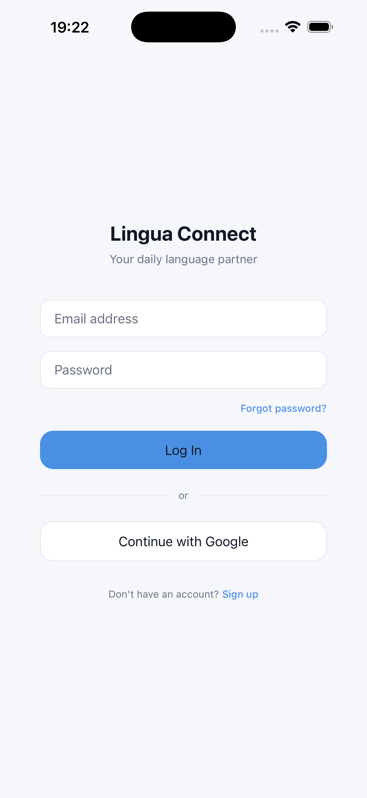
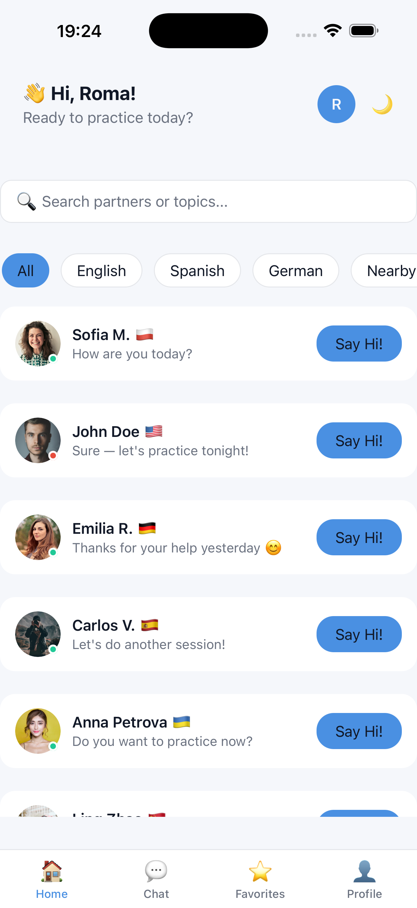
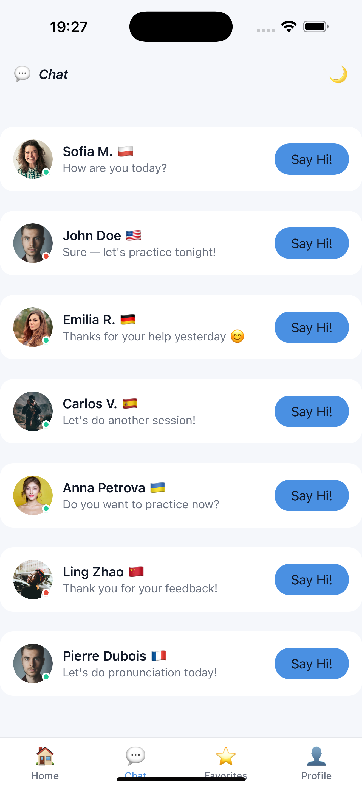
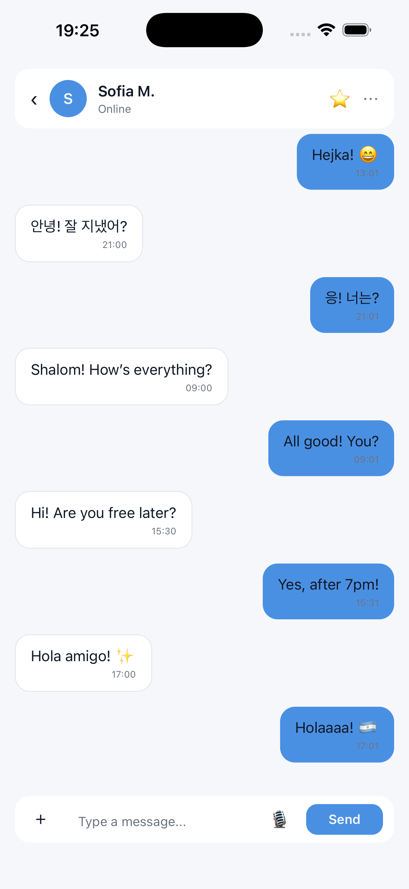
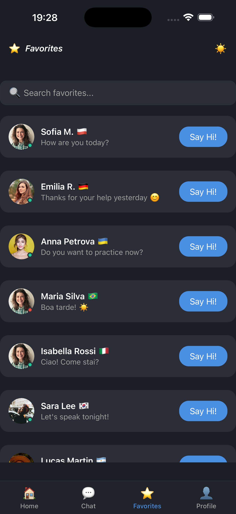
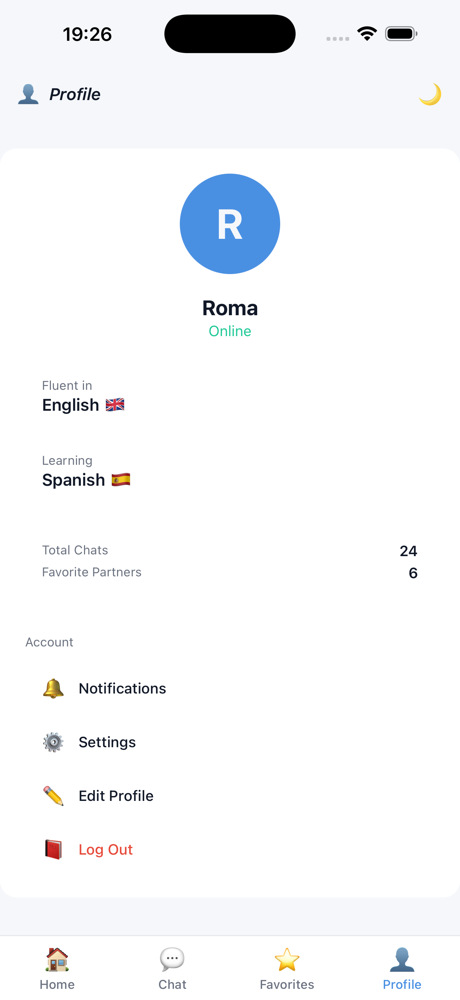

---

## 📌 Документація змін та прийнятих рішень

У межах останнього етапу розробки застосунку **LinguaConnect** було реалізовано з нуля повноцінну систему авторизації, навігації, архітектурну структуру та логіку захисту доступу до екранів. Нижче наведено опис ключових рішень.

---

### 🔹 1. Авторизація (реалізовано з нуля)

На момент початку роботи над цим етапом **механізм авторизації був відсутній**.  
Було реалізовано:

- Login / Register / Forgot Password
- Збереження сесії користувача в Redux
- Відновлення авторизації після перезапуску застосунку
- Емуляція бекенду через `services`
- Обробка помилок та loading-станів

✅ Логіка авторизації винесена в кастомні хуки:
- `useLogin`
- `useRegister`
- `useForgotPassword`

✅ Компоненти не містять бізнес-логіки — тільки UI.

---

### 🔹 2. Захист маршрутів (Auth Guard)

Після впровадження авторизації було додано механізм захисту закритих екранів:

- Якщо користувач **не авторизований** — він автоматично перенаправляється на `/login`
- Якщо користувач **авторизований** — дозволяється доступ до `(tabs)`
- Логіка перевірки винесена в окремий сервіс / хук

✅ Це запобігає доступу до чатів та профілю без сесії.

---

### 🔹 3. Навігація

Реалізовано класичну мобільну навігацію на базі **expo-router**:

**Root Stack**
- **(auth)**
    - login
    - register
    - forgotPassword
- **(tabs)**
    - home
    - chat
    - favorites
    - profile
- **chat/[chatId]** — dynamic route для персональних чатів

✅ Підтримується:
- dynamic routing (`chat/[chatId]`)
- swipe-back на iOS
- `router.push`, `router.replace`, `router.back`

---

### 🔹 4. Архітектура

Було впроваджено чітке розділення відповідальностей:

app/ → навігація та екрани
components/ → UI
hooks/ → бізнес-логіка
services/ → API та емуляція бекенду
store/ → Redux Toolkit
constants/ → дизайн-система
context/ → тема

✅ Принципи:
- ❌ без логіки в UI
- ✅ уся логіка в хуках
- ✅ API тільки через services
- ✅ Redux тільки для глобального стану

---

### 🔹 5. Передача даних та типізація

- Типізовані параметри маршрутів (`chatId`)
- Типізовані API-запити
- Захист від "тихих" помилок
- Строга типізація Redux

---

### 🔹 6. Теми та стилі

- Світла та темна тема
- `ThemeContext`
- `useThemeColors`
- Централізовані кольори, відступи, шрифти

---

### 🔹 7. Чати

- Dynamic routing: `/chat/[chatId]`
- Пагінація повідомлень
- Стани: loading / loadingMore / hasMore
- Статус користувача
- Адаптація під клавіатуру

---

## 📸 Скріншоти застосунку

- Login Screen
  
- Home Screen
  
- Chat List Screen
  
- Chat Screen
  
- Favorite Screen
  
- Profile Screen
  

---